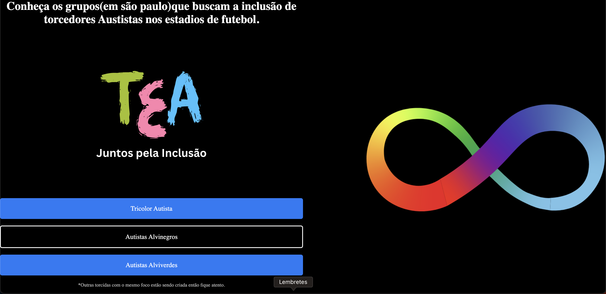
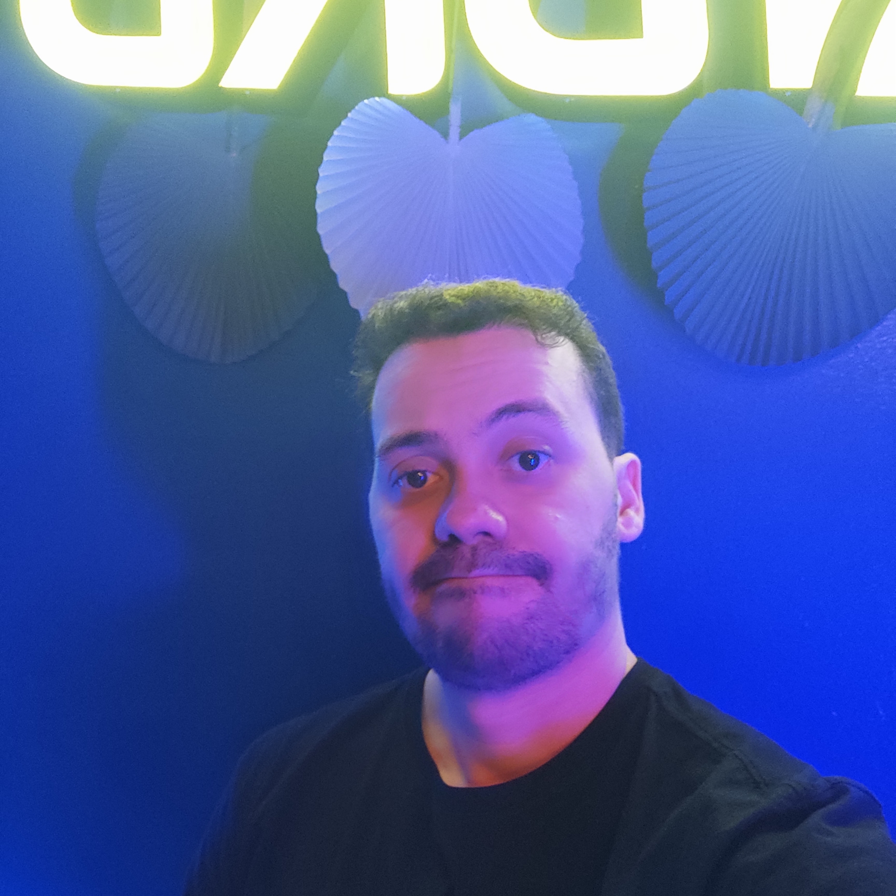

# Autistic Soccer Fanbase

> I developed a website showcasing autistic football fan communities, employing skills such as Flex Containers, Flex Items, and Flex Direction to create a dynamic and visually appealing platform for this inclusive project

### Adjustments and improvements.

The project is still under development, and the upcoming updates will focus on the following tasks:

- [x] Enhance the user experience through improvements in CSS design.

The following tools were used in the construction of the project:

- [HTML](<https://developer.mozilla.org/pt-BR/docs/Web/HTML/>)
- [CSS](<https://developer.mozilla.org/pt-BR/docs/Web/CSS/>)
- [Javascript](<https://developer.mozilla.org/pt-BR/docs/Web/JavaScript>)

Direct Website: [here](<https://spotity-thales.vercel.app/>)

## 🤝 Creator

<table>
  <tr>
    <td align="center">
      <a href="#" title="Thales Farias">
         
        
          <b>Thales Farias</b>
        
      </a>
    </td>
  </tr>
</table>
